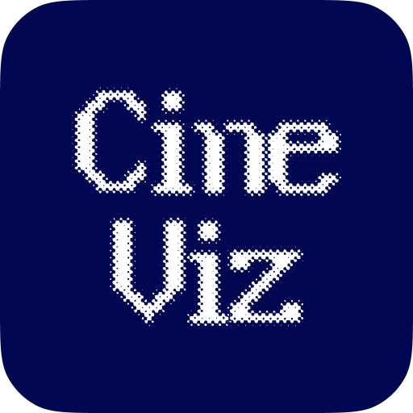

<div align="center">
  <p>
    <a href="#cineviz-ai---一站式计量电影学分析工具-中文">简体中文</a> | 
    <a href="#cineviz-ai---ALL-IN-ONE cinemetrics platform-english">English</a>
  </p>
  <p>
    <strong>Download (Local .exe software / 本地运行的 .exe 软件)</strong>
    <br />
    <a href="https://pan.baidu.com/s/1g8IpedwI7HgBeVv6Asqg8w?pwd=kmyf">Baidu Netdisk / 百度网盘</a> (Password: kmyf) | 
    <a href="https://drive.google.com/file/d/17awpA41tKObvWekPorBq-pmv8hU7b2yj/view?usp=sharing">Google Drive</a>
  </p>
</div>

---

# CineViz-AI - 一站式计量电影学分析工具

<div align="center">
  
  <h2 align="center">CineViz-AI</h2>
  <p align="center">
    基于计量电影学与深度学习的视频节奏与视觉分析工具。
    <br />
    <br />
    <a href="https://github.com/LuN3cy/LuN3cy"><strong>网页精简版 »</strong></a>
  </p>
</div>

## 💡 设计思路

**CineViz-AI** 的设计核心是“让电影计量学走入日常工具”。我们致力于将专业的电影视觉分析方法论与现代深度学习技术相结合，为创作者、研究者和爱好者提供一个直观、高效的分析平台。

- **计量驱动 (Metrology-driven)**: 核心算法基于电影计量学（Cinemetrics），提供 ASL（平均镜头长度）、MSL（中位镜头长度）等专业指标。
- **隐私优先 (Privacy-First)**: 所有视频处理和 AI 分析均在本地完成，确保您的素材和隐私数据永远不会离开您的设备。
- **AI 增强 (AI-Enhanced)**: 深度集成 TransNetV2、MovieNet 等行业级模型，自动完成镜头拆解与景别识别。
- **交互可视化 (Interactive Visualization)**: 将抽象的视觉数据转化为可交互的时间轴、色彩指纹和动态图表。

## ✨ 现有功能

### 1. 自动镜头检测与节奏分析 (Shot Detection)
基于 **TransNetV2** 深度学习模型，自动识别视频中的硬切、淡入淡出等转场。
- 自动计算平均镜头长度 (ASL) 和中位镜头长度 (MSL)。
- 生成剪辑密度图表，量化视频节奏。

### 2. 视觉特征提取 (Visual Analysis)
逐帧分析视频的物理属性，生成直观的视觉走势图。
- **亮度 (Brightness)** 与 **饱和度 (Saturation)** 的动态分布曲线。
- **色彩指纹 (Color Fingerprint)**: 将整部影片的色彩风格浓缩为一张独特的指纹图。

### 3. 智能景别识别 (Shot Scale Classification)
利用 **MovieNet** 模型，自动对每一个镜头进行景别分类（特写、中景、远景等）。
- 统计全片景别分布比例。
- 帮助分析导演的叙事空间偏好。

### 4. 交互式微调与导出 (Finetune & Export)
提供“微调模式”，允许用户对 AI 检测的结果进行人工修正。
- 支持导出为标准 EDL 剪辑表，方便导入 PR/Final Cut。
- 支持导出详细的 CSV 数据报表进行二次研究。

## 🧠 技术模型

| 模型名称 | 用途 | 核心技术 |
| :--- | :--- | :--- |
| **TransNetV2** | 镜头边界检测 | 深度学习时域卷积网络 |
| **MovieNet** | 景别分类 | 电影工业级 Shot-Scale 识别模型 |
| **Depth-Anything-V2** | 深度估计 | 高精度单目深度估计算法 |
| **ONNX Runtime** | 模型推理加速 | 高性能跨平台推理引擎 |

---

# CineViz-AI - ALL-IN-ONE cinemetrics platform

<div align="center">
  
  <h2 align="center">CineViz-AI</h2>
  <p align="center">
    A powerful tool for cinematic rhythm and visual analysis, powered by AI.
    <br />
    <br />
    <a href="https://github.com/LuN3cy/LuN3cy"><strong>Web Lite Version »</strong></a>
  </p>
</div>

## 💡 Design Philosophy

**CineViz-AI** is designed to bring cinemetrics into everyday creative workflows. We combine professional cinematic analysis methodologies with modern deep learning to provide an intuitive, high-performance platform for creators, researchers, and film enthusiasts.

- **Metrology-driven**: Built on professional cinemetrics indicators like ASL (Average Shot Length) and MSL (Median Shot Length).
- **Privacy-First**: All video processing and AI analysis happen locally on your machine. Your media never leaves your device.
- **AI-Enhanced**: Deep integration with industry-standard models like TransNetV2 and MovieNet for automated shot boundary and scale detection.
- **Interactive Visualization**: Transform abstract visual data into interactive timelines, color fingerprints, and dynamic charts.

## ✨ Features

### 1. Automated Shot Detection & Rhythm Analysis
Powered by **TransNetV2**, it automatically detects hard cuts and transitions.
- Calculates ASL and MSL automatically.
- Generates cutting density charts to quantify cinematic rhythm.

### ### 2. Visual Feature Extraction
Frame-by-frame analysis of physical video attributes.
- **Brightness** & **Saturation** dynamic curves.
- **Color Fingerprint**: A unique visual summary of the film's entire color palette.

### 3. Intelligent Shot Scale Classification
Uses **MovieNet** to classify each shot into categories like Close-up, Medium, or Wide shots.
- Statistical distribution of shot types across the entire video.
- Helps analyze spatial narrative preferences.

### 4. Interactive Finetuning & Export
Finetune AI results and export data for professional workflows.
- Export to standard EDL for PR/Final Cut.
- Export detailed CSV reports for academic research.

## 🧠 Technical Models

| Model | Usage | Core Technology |
| :--- | :--- | :--- |
| **TransNetV2** | Shot Boundary Detection | Temporal Convolutional Network |
| **MovieNet** | Shot Scale Classification | Industry-standard Shot-Scale model |
| **Depth-Anything-V2** | Depth Estimation | Monocular Depth Estimation |
| **ONNX Runtime** | Inference Acceleration | High-performance inference engine |

---

## 🚀 Getting Started / 快速开始 (Development)

1. **Clone & Install**
   ```bash
   git clone https://github.com/LuN3cy/CineViz.git
   cd CineViz
   npm install
   ```

2. **Run Desktop Version (Recommended)**
   ```bash
   npm run dev:python
   ```

3. **MovieNet Setup**
   ```bash
   npm run setup:movienet
   ```

## 🛠 Tech Stack / 技术栈

- **Frontend**: React 19, TypeScript, Vite, Tailwind CSS
- **Backend**: Python 3.11, PyWebView, FastAPI (Streaming)
- **Deep Learning**: PyTorch, ONNX Runtime, Ultralytics (YOLO)
- **Visualization**: Recharts, D3.js

## 📬 Contact / 联系我们

- **Official Account 公众号**: [LuN3cy的实验房](https://mp.weixin.qq.com/s/1234567890abcdef12345)
- **RED 小红书**: [LuN3cy](https://www.xiaohongshu.com/user/64f2f2000000000001000000)
- **Bilibili**: [LuN3cy](https://space.bilibili.com/123456789)
- **个人站**: [LuN3cy](https://lun3cy.top)

---

<div align="center">
  Made with ❤️ by <a href="https://github.com/LuN3cy">LuN3cy</a>
</div>
